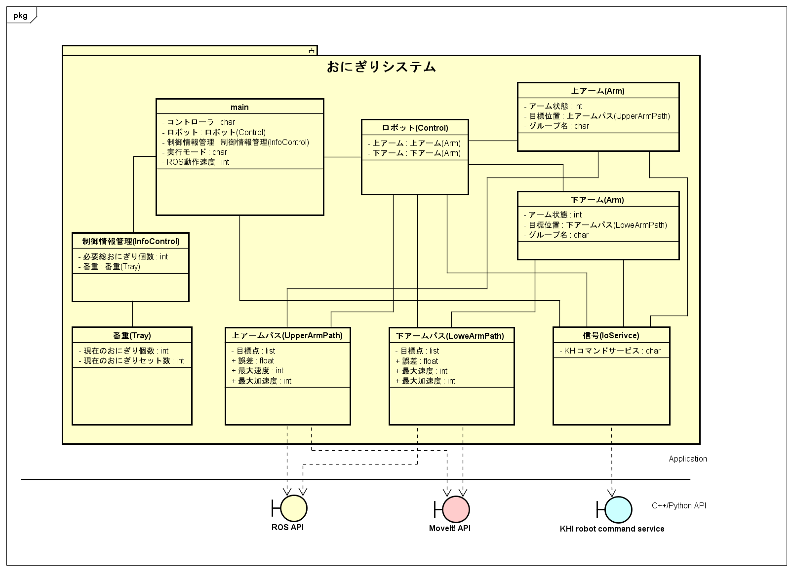
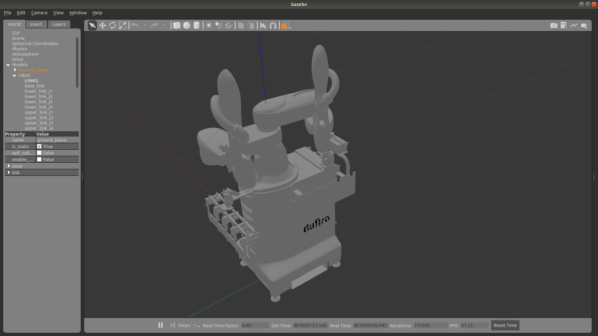
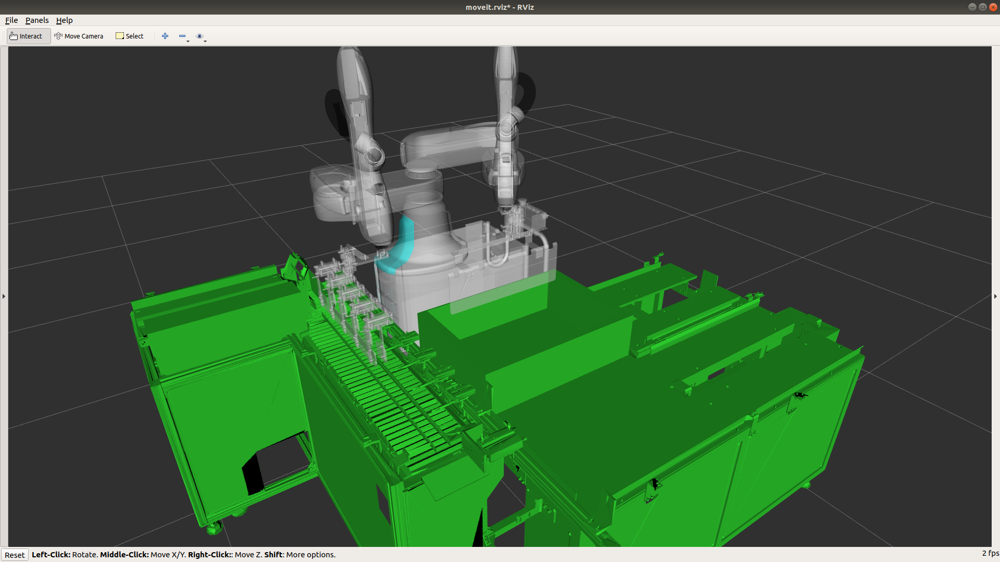

# duAro おにぎりシステム

## はじめに

本パッケージはduAroのおにぎり番重詰適用をROSアプリにより実現したものです。

おにぎり番重詰め適用とは、食品工場からおにぎりを出荷する際の番重詰め作業をロボットにより自動化する適用です。

## システム解説

### システム要件

対応ROSバージョン：Melodic

対応機種：duAro1

### クラス構成

おにぎりシステムのクラス構成を記載します。



|クラス名|説明|実装ファイル|
|---|---|---|
|Control|ロボット(duAro)制御クラス|duaro.py|
|Arm(下アーム) |下アーム制御クラス|lower.py|
|Arm(上アーム) |上アーム制御クラス|upper.py|
|LowerArmPath|下アーム動作計画クラス|duaro_plan.py|
|UpperArmPath|下アーム動作計画クラス|duaro_plan.py|
|IoService|IO制御などのKHIコマンドサービスクラス|IO.py|
|InfoControl|おにぎり、番重などの制御情報管理クラス|device.py|
|Tray|番重管理クラス|device.py|


## 準備

### KHIロボット用ROSドライバー

KHIロボットのROSドライバーである ```khi_robot``` をインストールしてください。詳細は[git-hub](https://github.com/Kawasaki-Robotics/khi_robot)参照。

### ロボット動作姿勢教示

ロボットの教示方法は
[ROSおにぎりシステム教示用資料.pdf](./doc/ROSおにぎりシステム教示用資料.pdf)
を参照

## 実行方法

### シミュレーション環境(Gazebo)

#### 1. Gazebo起動

```
roslaunch khi_duaro_onigiri_system duaro_world.launch
```


#### 2. MoveIt!起動

```
roslaunch khi_duaro_onigiri_system moveit_planning_execution.launch
```
MoveIt!が起動すると同時にrvizが立ち上がり、duAro本体のモデルとともにコンベア台、番重台、番重のモデルも読み込まれます。

このモデルの読み込みには30秒ほど時間がかかります。

#### 3. おにぎりシステム起動

```
roslaunch khi_duaro_onigiri_system execute_onigiri_system.launch simulation:=true
```

起動後はまず初期位置にロボットが移動後、全ての動作の事前プランニングが行われます。

プランニング終了後は以下のようになメッセージがおにぎりシステムを起動したターミナルに表示されます。
```
 Enter to Start
```
エンターキーを押下することで適用動作が開始されます。
デフォルト設定では速度100%、サイクル動作10000回で実行されますので動作を途中で終了する場合は`Ctl+C`を入力してください。

### 実機環境(duAro1)

実機環境での動作には、ロボット用セーブデータや
セル環境を準備する必要があります。
実施の際には、KHIの営業担当者までご連絡ください。

## パラメータ設定

[実行方法 3. おにぎりシステム起動](#3-おにぎりシステム起動) 時のコマンド末尾に以下のオプションを設定することで
各種パラメータの変更が可能になります。

```
roslaunch khi_duaro_onigiri_system execute_onigiri_system.launch　`オプション`
```

### シミュレーションモードの有効/無効

```
    simulation := true
```

`true`にすることでKHIロボットROSドライバーへの通信を行わなくなり
IO制御も無効化されるため、PC上のみのシミュレーションが可能になります。オプション指定なしで`false`になります。

### 実行時の問い合わせの有無

```
    keyboard_input := true
```
`true`にすることでコマンド実行後の問い合わせが表示されるようになります。オプション指定なしで`false`になります。

問い合わせ内容は以下の１項目です。

・ 速度設定(デフォルト100%)

初めて実機を動作させる際は速度10%以下に指定しての動作確認を必ず行ってください。

### サイクル動作繰り返し回数

```
    cycle_num := '繰り返し回数'
```
ロボットが番重におにぎりを50個詰める動作で1サイクルになっています。このサイクルの繰り返し回数を変更します。オプション指定なしで10,000回繰り返されます。

## エラーメッセージ

[実行方法 3. おにぎりシステム起動](#3-おにぎりシステム起動) のターミナルで出力されるエラーメッセージについて説明します。

|エラーメッセージ|説明|
|---|---|
|Auto recovery has been impossible and Robot stopped. Please recovery in manual.|ロボットコントローラ側でエラーが発生したため、サイクル動作を停止させています。|
|System malfunction is detected. Please check system.|おにぎりシステム側でエラーが発生したためサイクル動作を停止させています。PLCやロボットコントローラとのIO通信で異常が発生している可能性があります。|
|Planning has failed.|動作プランニングに失敗しました。ロボットの初期姿勢により動作できなくなっている可能性があります。|
